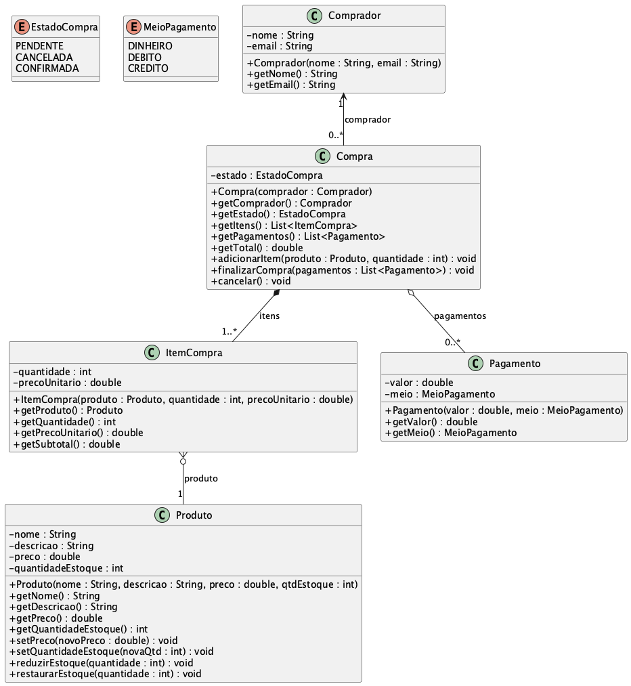

<!-- 
  Exportar para PDF: Markdown Preview Enhanced → preview ao lado → botão direito no preview → Export → PDF.
  Imagens: exporte o PlantUML para PNG e coloque em docs/ (ou ajuste os caminhos nas figuras abaixo).
  Caminhos das imagens são relativos a ESTE arquivo (pasta docs/).
-->

# Relatório — Modelagem UML e Programação Orientada a Objetos

## Declaração de uso de ferramentas assistidas por IA

Declaro, para fins de transparência acadêmica, que utilizei **inteligência artificial generativa** (assistente de código / chat) como **apoio** na elaboração do **README** do repositório do projeto e na **montagem deste esqueleto em Markdown** utilizado como base para gerar o **PDF** deste relatório. O conteúdo técnico (modelagem, implementação e compreensão do código) foi revisado por mim, e a entrega final é de minha responsabilidade.

---

## 1. Identificação do aluno e do trabalho

| Campo | Informação |
|--------|------------|
| **Aluno** | Diogo Dognini Corrêa |
| **Disciplina** | Programação Orientada a Objetos |
| **Instituição** | Univali |
| **Repositório Git** | https://github.com/dognini/Modelagem-UML |
| **Data de entrega** | 31/03/2026 |

---

## 2. Enunciado dos projetos

### 2.1 Projeto 1 — Diagrama UML a partir da descrição

Sistema de **compras online** com:

- **Produto:** nome e descrição imutáveis; preço e quantidade em estoque não podem ser zero nem negativos; associação a zero ou várias compras (via itens).
- **Compra:** um ou mais itens; um comprador; estado **PENDENTE**, **CANCELADA** ou **CONFIRMADA**; zero ou vários pagamentos; operações de adicionar item e finalizar compra (definindo pagamentos).
- **ItemCompra:** produto, quantidade, preço; pertence a uma única compra.
- **Pagamento:** valor; meio **DINHEIRO**, **DÉBITO** ou **CRÉDITO**.

**Regras:** validar preço e quantidade (valores não podem ser menores ou iguais a zero); requisitos extras permitidos quando coerentes.

---

### 2.2 Projeto 2 — Implementação em Java a partir do diagrama UML

Implementar as classes em Java conforme o **diagrama de classes** fornecido pela disciplina _(por exemplo, sistema de hotel: `Pessoa`, `Funcionario`, `Hospede`, `Hotel`, `Quarto`, `Reserva`, `Veiculo`, `Cargo`)_.

---

## 3. Diagramas UML

### 3.1 Projeto 1 — Sistema de compras online

O diagrama de classes foi modelado em PlantUML no arquivo `diagramas/sistema-compras-online.puml` (na raiz do repositório).

**Figura 1 — Diagrama de classes (Projeto 1)**



---

## 5. Códigos-fonte

O código abaixo corresponde aos arquivos em `src/main/java/com/modelagem/pooprojeto1/` no repositório.

### 5.1 Pacote `com.modelagem.pooprojeto1`

#### `Main.java`

```java
package com.modelagem.pooprojeto1;

import com.modelagem.pooprojeto1.modelo.Compra;
import com.modelagem.pooprojeto1.modelo.Comprador;
import com.modelagem.pooprojeto1.modelo.EstadoCompra;
import com.modelagem.pooprojeto1.modelo.MeioPagamento;
import com.modelagem.pooprojeto1.modelo.Pagamento;
import com.modelagem.pooprojeto1.modelo.Produto;

import java.util.Arrays;
import java.util.List;

public class Main {

    public static void main(String[] args) {
        Produto notebook = new Produto(
                "Notebook",
                "Notebook 8GB RAM",
                3500.00,
                10
        );
        Produto mouse = new Produto(
                "Mouse",
                "Mouse sem fio",
                89.90,
                50
        );

        Comprador ana = new Comprador("Ana", "ana@email.com");
        Compra compra = new Compra(ana);

        compra.adicionarItem(notebook, 1);
        compra.adicionarItem(mouse, 2);

        System.out.println("Comprador: " + compra.getComprador().getNome());
        System.out.println("Itens: " + compra.getItens().size());
        System.out.println("Total: R$ " + String.format("%.2f", compra.getTotal()));
        System.out.println("Estado: " + compra.getEstado());

        double total = compra.getTotal();
        List<Pagamento> pagamentos = Arrays.asList(
                new Pagamento(total * 0.5, MeioPagamento.CREDITO),
                new Pagamento(total * 0.5, MeioPagamento.DEBITO)
        );
        compra.finalizarCompra(pagamentos);

        System.out.println("Estado após finalizar: " + compra.getEstado());
        System.out.println("Estoque notebook: " + notebook.getQuantidadeEstoque());
        System.out.println("Estoque mouse: " + mouse.getQuantidadeEstoque());
        System.out.println("Pagamentos: " + compra.getPagamentos().size());

        demonstrarCancelamento();
    }

    private static void demonstrarCancelamento() {
        System.out.println();
        System.out.println("--- Compra cancelada (exemplo) ---");
        Compra c = new Compra(new Comprador("Bruno", "bruno@email.com"));
        c.adicionarItem(new Produto("Caneta", "Azul", 2.50, 100), 3);
        c.cancelar();
        System.out.println("Estado: " + c.getEstado() + " (esperado: " + EstadoCompra.CANCELADA + ")");
        System.out.println("Itens após cancelar: " + c.getItens().size());
    }
}
```

#### `modelo/EstadoCompra.java`

```java
package com.modelagem.pooprojeto1.modelo;

public enum EstadoCompra {
    PENDENTE,
    CANCELADA,
    CONFIRMADA
}
```

#### `modelo/MeioPagamento.java`

```java
package com.modelagem.pooprojeto1.modelo;

public enum MeioPagamento {
    DINHEIRO,
    DEBITO,
    CREDITO
}
```

#### `modelo/Comprador.java`

```java
package com.modelagem.pooprojeto1.modelo;

public class Comprador {

    private final String nome;
    private final String email;

    public Comprador(String nome, String email) {
        if (nome == null || nome.isBlank()) {
            throw new IllegalArgumentException("Nome do comprador não pode ser vazio.");
        }
        if (email == null || email.isBlank()) {
            throw new IllegalArgumentException("E-mail do comprador não pode ser vazio.");
        }
        this.nome = nome.trim();
        this.email = email.trim();
    }

    public String getNome() {
        return nome;
    }

    public String getEmail() {
        return email;
    }
}
```

#### `modelo/Produto.java`

```java
package com.modelagem.pooprojeto1.modelo;

public class Produto {

    private final String nome;
    private final String descricao;
    private double preco;
    private int quantidadeEstoque;

    public Produto(String nome, String descricao, double preco, int quantidadeEstoque) {
        if (nome == null || nome.isBlank()) {
            throw new IllegalArgumentException("Nome do produto não pode ser vazio.");
        }
        if (descricao == null || descricao.isBlank()) {
            throw new IllegalArgumentException("Descrição do produto não pode ser vazia.");
        }
        validarPreco(preco);
        validarQuantidadeEstoque(quantidadeEstoque);

        this.nome = nome.trim();
        this.descricao = descricao.trim();
        this.preco = preco;
        this.quantidadeEstoque = quantidadeEstoque;
    }

    public String getNome() {
        return nome;
    }

    public String getDescricao() {
        return descricao;
    }

    public double getPreco() {
        return preco;
    }

    public int getQuantidadeEstoque() {
        return quantidadeEstoque;
    }

    public static void validarPreco(double preco) {
        if (preco <= 0) {
            throw new IllegalArgumentException("Preço deve ser maior que zero.");
        }
    }

    public static void validarQuantidadeEstoque(int qtd) {
        if (qtd <= 0) {
            throw new IllegalArgumentException("Quantidade em estoque deve ser maior que zero.");
        }
    }

    public void setPreco(double novoPreco) {
        validarPreco(novoPreco);
        this.preco = novoPreco;
    }

    public void setQuantidadeEstoque(int novaQtd) {
        validarQuantidadeEstoque(novaQtd);
        this.quantidadeEstoque = novaQtd;
    }

    public void reduzirEstoque(int quantidade) {
        if (quantidade <= 0) {
            throw new IllegalArgumentException("Quantidade a reduzir deve ser maior que zero.");
        }
        if (quantidade > quantidadeEstoque) {
            throw new IllegalStateException("Estoque insuficiente para o produto: " + nome);
        }
        this.quantidadeEstoque -= quantidade;
    }

    public void restaurarEstoque(int quantidade) {
        if (quantidade <= 0) {
            throw new IllegalArgumentException("Quantidade a restaurar deve ser maior que zero.");
        }
        this.quantidadeEstoque += quantidade;
    }
}
```

#### `modelo/ItemCompra.java`

```java
package com.modelagem.pooprojeto1.modelo;

public class ItemCompra {

    private final Produto produto;
    private final int quantidade;
    private final double precoUnitario;

    public ItemCompra(Produto produto, int quantidade, double precoUnitario) {
        if (produto == null) {
            throw new IllegalArgumentException("Produto não pode ser nulo.");
        }
        if (quantidade <= 0) {
            throw new IllegalArgumentException("Quantidade do item deve ser maior que zero.");
        }
        Produto.validarPreco(precoUnitario);

        this.produto = produto;
        this.quantidade = quantidade;
        this.precoUnitario = precoUnitario;
    }

    public Produto getProduto() {
        return produto;
    }

    public int getQuantidade() {
        return quantidade;
    }

    public double getPrecoUnitario() {
        return precoUnitario;
    }

    /** Subtotal = quantidade × preço unitário (valores congelados no item). */
    public double getSubtotal() {
        return quantidade * precoUnitario;
    }
}
```

#### `modelo/Pagamento.java`

```java
package com.modelagem.pooprojeto1.modelo;

public class Pagamento {

    private final double valor;
    private final MeioPagamento meio;

    public Pagamento(double valor, MeioPagamento meio) {
        if (valor <= 0) {
            throw new IllegalArgumentException("Valor do pagamento deve ser maior que zero.");
        }
        if (meio == null) {
            throw new IllegalArgumentException("Meio de pagamento não pode ser nulo.");
        }
        this.valor = valor;
        this.meio = meio;
    }

    public double getValor() {
        return valor;
    }

    public MeioPagamento getMeio() {
        return meio;
    }
}
```

#### `modelo/Compra.java`

```java
package com.modelagem.pooprojeto1.modelo;

import java.util.List;
import java.util.ArrayList;
import java.util.Collections;

public class Compra {

    private final Comprador comprador;
    private EstadoCompra estado;
    private final List<ItemCompra> itens;
    private final List<Pagamento> pagamentos;

    public Compra(Comprador comprador) {
        if (comprador == null) {
            throw new IllegalArgumentException("Comprador não pode ser nulo.");
        }
        this.comprador = comprador;
        this.estado = EstadoCompra.PENDENTE;
        this.itens = new ArrayList<>();
        this.pagamentos = new ArrayList<>();
    }

    public Comprador getComprador() {
        return comprador;
    }

    public EstadoCompra getEstado() {
        return estado;
    }

    public List<ItemCompra> getItens() {
        return Collections.unmodifiableList(itens);
    }

    public List<Pagamento> getPagamentos() {
        return Collections.unmodifiableList(pagamentos);
    }

    public double getTotal() {
        double total = 0;
        for (ItemCompra item : itens) {
            total += item.getSubtotal();
        }
        return total;
    }

    public void adicionarItem(Produto produto, int quantidade) {
        if (estado != EstadoCompra.PENDENTE) {
            throw new IllegalStateException("Só é possível adicionar itens com compra PENDENTE.");
        }
        if (produto == null) {
            throw new IllegalArgumentException("Produto não pode ser nulo.");
        }
        if (quantidade <= 0) {
            throw new IllegalArgumentException("Quantidade deve ser maior que zero.");
        }
        if (quantidade > produto.getQuantidadeEstoque()) {
            throw new IllegalStateException(
                    "Estoque insuficiente para " + produto.getNome()
                            + ". Disponível: " + produto.getQuantidadeEstoque());
        }

        ItemCompra item = new ItemCompra(produto, quantidade, produto.getPreco());
        itens.add(item);
    }

    public void finalizarCompra(List<Pagamento> novosPagamentos) {
        if (estado != EstadoCompra.PENDENTE) {
            throw new IllegalStateException("Só é possível finalizar compra PENDENTE.");
        }
        if (itens.isEmpty()) {
            throw new IllegalStateException("Compra precisa ter pelo menos um item.");
        }
        if (novosPagamentos == null || novosPagamentos.isEmpty()) {
            throw new IllegalArgumentException("Informe ao menos um pagamento.");
        }

        for (ItemCompra item : itens) {
            Produto p = item.getProduto();
            if (item.getQuantidade() > p.getQuantidadeEstoque()) {
                throw new IllegalStateException(
                        "Estoque insuficiente ao finalizar para: " + p.getNome());
            }
        }

        double somaPagamentos = 0;
        for (Pagamento pg : novosPagamentos) {
            somaPagamentos += pg.getValor();
        }
        double total = getTotal();
        if (Math.abs(somaPagamentos - total) > 0.01) {
            throw new IllegalArgumentException("Soma dos pagamentos (" + somaPagamentos + ") deve ser igual ao total (" + total + ")");
        }

        for (ItemCompra item : itens) {
            item.getProduto().reduzirEstoque(item.getQuantidade());
        }

        pagamentos.clear();
        pagamentos.addAll(novosPagamentos);
        estado = EstadoCompra.CONFIRMADA;
    }

    public void cancelar() {
        if (estado != EstadoCompra.PENDENTE) {
            throw new IllegalStateException("Só é possível cancelar compra PENDENTE.");
        }
        estado = EstadoCompra.CANCELADA;
        itens.clear();
    }
}
```

### 5.2 Execução

```
Comprador: Ana
Itens: 2
Total: R$ 3679,80
Estado: PENDENTE
Estado após finalizar: CONFIRMADA
Estoque notebook: 9
Estoque mouse: 48
Pagamentos: 2

--- Compra cancelada (exemplo) ---
Estado: CANCELADA (esperado: CANCELADA)
Itens após cancelar: 0
```

_(A formatação numérica do total pode variar conforme o locale do sistema.)_

---

## Referências

- Documentação Java / materiais da disciplina.
- PlantUML: https://plantuml.com
